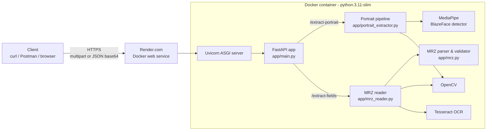
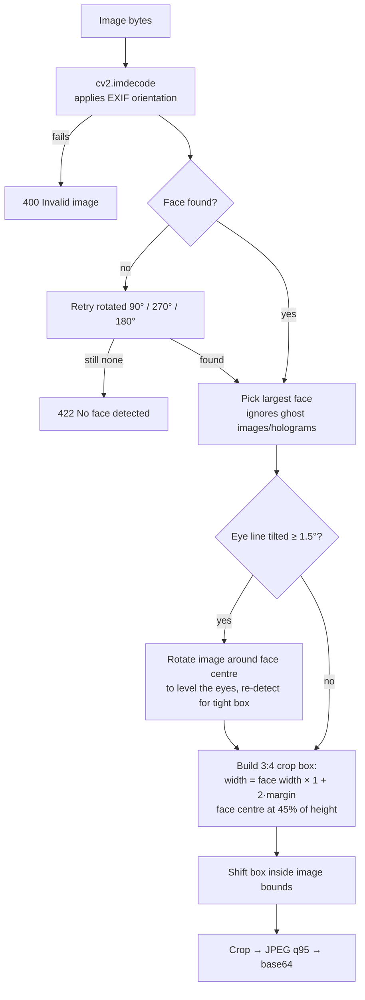
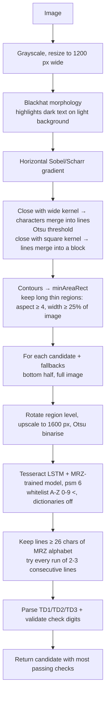
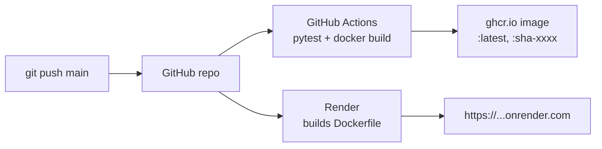

# Solution & Design Document — ID Portrait Extractor

## 1. Problem statement

Build an HTTP API that receives a photo or scan of an identity document (ID card, passport), finds the holder's portrait photo, and returns it as a base64-encoded image. The service must be containerised and deployed publicly.

**Bonus:** extract the holder's data fields (name, document number, date of birth, expiry date, …) by reading the document's **Machine Readable Zone (MRZ)**.

### Inputs we must handle

| Situation | Example in `sample_images/` |
|---|---|
| Clean flat scan | `alb_id_clean_template.jpg`, passport specimens |
| Phone photo, card tilted on a table | `alb_id_on_table.jpg`, `alb_id_angled_clean_bg.jpg` |
| Card held in hand / cluttered background | `alb_id_in_hand.jpg`, `alb_id_on_keyboard.jpg` |
| Secondary "ghost" portrait printed on the card | Norway, Netherlands, Albania |
| Image rotated 90° / 180° | (tested by rotating the samples in the tests) |
| No face / no MRZ / corrupt file | handled with explicit error codes |

---

## 2. Architecture



### Components

| Component | File | Responsibility |
|---|---|---|
| API layer | `app/main.py` | Routing, input decoding (multipart / base64 / data-URL), upload size limit, mapping domain errors to HTTP status codes, CORS, OpenAPI docs |
| Schemas | `app/schemas.py` | Pydantic request/response models — drive validation and the generated Swagger docs |
| Portrait pipeline | `app/portrait_extractor.py` | Decode → detect face → orientation recovery → deskew → 3:4 framing → JPEG |
| MRZ reader | `app/mrz_reader.py` | Locate the MRZ block, deskew it, OCR it with Tesseract |
| MRZ parser | `app/mrz.py` | ICAO 9303 parsing of TD1/TD2/TD3, check-digit validation, OCR error correction |

### Technology choices

| Need | Choice | Why |
|---|---|---|
| Web framework | **FastAPI** + Uvicorn | Automatic request validation and interactive OpenAPI/Swagger docs (`/docs`) from the type hints; async-capable; minimal boilerplate |
| Face detection | **MediaPipe Face Detection** (BlazeFace, full-range model) | Accurate on small/blurred faces and low-contrast printed photos, runs fast on CPU (~20–40 ms), ships its model inside the wheel (no downloads), returns **eye keypoints** used for deskewing |
| Image processing | **OpenCV** | Decoding (incl. EXIF orientation), rotation, morphology for MRZ localisation, JPEG encoding |
| OCR | **Tesseract 5** (LSTM) via `pytesseract`, with an **MRZ-trained model** (`mrz.traineddata`, [DoubangoTelecom/tesseractMRZ](https://github.com/DoubangoTelecom/tesseractMRZ), BSD-3) | Free, small, runs on CPU, supports a character whitelist. The bundled model is trained on the OCR-B MRZ font, so it reads the `<` filler reliably |
| Container | `python:3.11-slim` | Small base image with wheels available for every dependency |
| Hosting | **Render** (free Docker web service) | Builds directly from the repository's Dockerfile, HTTPS out of the box, auto-deploy on push |
| CI | **GitHub Actions** | Runs the test suite, builds the image and publishes it to GitHub Container Registry |

**Alternatives considered for face detection**

| Option | Verdict |
|---|---|
| OpenCV Haar cascade | Very light but many false positives on textured security backgrounds (guilloche patterns) and misses tilted faces |
| dlib HOG / CNN | Good accuracy but heavy build (needs CMake/compilers) and slower on CPU |
| MTCNN / RetinaFace | Very accurate but pulls in TensorFlow/PyTorch → image size of 1–2 GB, too large for a free tier |
| Document-layout model (detect the photo rectangle) | Would give the exact printed photo border, but requires training data per document type |
| **MediaPipe** ✅ | Best accuracy/size/speed trade-off; keypoints come for free |

---

## 3. Portrait extraction approach

The key insight: **the portrait is the largest face on the document.** Rather than trying to understand every country's card layout, we detect faces and frame the biggest one the way an ID photo is framed.



### Step details

1. **Decode.** `cv2.imdecode(..., IMREAD_COLOR)` supports JPEG/PNG/WebP/BMP/TIFF and honours the EXIF orientation flag, so phone photos are upright before detection.
2. **Detect.** MediaPipe's *full-range* model (`model_selection=1`) is used because the face on a document photographed from a distance can be small. Detections below 0.5 confidence are dropped.
3. **Orientation recovery.** If no face is found, the image is retried rotated 90°, 270° and 180°. This handles sideways scans and upside-down photos at no cost for the normal case.
4. **Choose the portrait.** Many modern documents print a smaller secondary "ghost" portrait (Norway, Netherlands, Albania samples). Choosing the **largest** box reliably selects the main photo.
5. **Deskew.** MediaPipe returns the two eye keypoints. The angle of the line between them is the in-plane tilt of the card. If it exceeds 1.5°, the image is rotated about the face centre (`cv2.warpAffine`, border replicate) so the eyes are level, then the face is re-detected to get a tight box on the levelled image. The applied rotation is reported back as `rotation_degrees`.
6. **Frame.** ID photos are 3:4 with the head occupying the upper-middle of the frame. The crop width is `face_width × (1 + 2·margin)` (default `margin = 0.3`), height is `width × 4/3`, and the face centre is placed at 45% of the crop height — leaving room for hair above and shoulders below.
7. **Clamp.** If the box extends beyond the image, it is **shifted** back inside rather than shrunk, so the aspect ratio is preserved whenever the image is big enough.
8. **Encode.** JPEG quality 95, base64-encoded in the JSON response along with dimensions, detector confidence and face count.

### Performance & concurrency

* The MediaPipe detector is created **once** (lazily) and reused instead of loading the model graph on every request.
* MediaPipe graphs are not thread-safe. FastAPI runs the (synchronous, CPU-bound) endpoints in a thread pool, so detection is guarded by a lock. The event loop is never blocked by image processing.
* Typical latency on a laptop CPU: 50–150 ms for the portrait, 0.3–1.5 s for MRZ OCR.

---

## 4. Bonus: field extraction from the Machine Readable Zone

### 4.1 What the MRZ is (ICAO Doc 9303)

The MRZ is the block of OCR-B text at the bottom of a passport data page or on the back of an ID card. It encodes the holder's data using only `A–Z`, `0–9` and the filler `<`, in fixed-width fields.

| Format | Used on | Layout |
|---|---|---|
| **TD1** | ID cards (credit-card size) | 3 lines × 30 chars |
| **TD2** | Older ID cards, some visas | 2 lines × 36 chars |
| **TD3** | Passports | 2 lines × 44 chars |

TD3 (passport) example, from the Norwegian specimen:

```
P<NOROESTENBYEN<<AASAMUND<SPECIMEN<<<<<<<<<<<
CCC0022514NOR5604230M3004157<<<<<<<<<<<<<<04
```

| Line 2 positions | Field | Value |
|---|---|---|
| 1–9 | Document number | `CCC002251` |
| 10 | Check digit | `4` |
| 11–13 | Nationality | `NOR` |
| 14–19 | Date of birth (YYMMDD) | `560423` |
| 20 | Check digit | `0` |
| 21 | Sex | `M` |
| 22–27 | Expiry date (YYMMDD) | `300415` |
| 28 | Check digit | `7` |
| 29–42 | Personal number / optional | empty |
| 43 | Check digit | `0` |
| 44 | Composite check digit | `4` |

Line 1 holds the document type (`P`), issuing state (`NOR`) and the name: `SURNAME<<GIVEN<NAMES`, with `<` as the word separator. Non-Latin letters are transliterated (Ø → OE, Å → AA).

**Check digits.** Each character is mapped to a value (`0–9` → 0–9, `A–Z` → 10–35, `<` → 0), multiplied by the repeating weights **7, 3, 1**, summed, and taken modulo 10. A composite digit covers all of the data line's protected fields. This makes the MRZ self-validating — and it lets us **correct OCR errors**.

### 4.2 Pipeline



### 4.3 Making OCR robust

**Choosing the OCR model.** The first version used Tesseract's general English model. It is not trained on the OCR-B font and misread the `<` filler as `K`, `X`, `S` or `R`, and the exact errors changed between Tesseract versions (5.4 on Windows vs 5.3 on Ubuntu CI gave different name lines for the same image). We therefore bundle `app/tessdata/mrz.traineddata`, a Tesseract model trained specifically on MRZ text. On the four passport specimens it reads every MRZ line character-perfect across all 6 preprocessing variants we tried (3 scales × gray/binarised), where the English model was wrong in most of them.

The parser still defends against residual OCR errors (photos, blur, other OCR engines) using the structure of the MRZ:

| Problem | Fix |
|---|---|
| `O`↔`0`, `I`↔`1`, `S`↔`5`, `B`↔`8`, `Z`↔`2` in **numeric** fields (dates, check digits) | Fields that can only be digits are mapped letter → digit before validation |
| Same confusions in **letter-only** fields (country codes, names) | Mapped digit → letter |
| Confusions in **alphanumeric** fields (document number, personal number) | If the check digit fails, ambiguous characters are swapped (fewest swaps first, preferring digits) until the check digit passes |
| Filler `<` read as `K` (`<<<<` → `KKKK`) in the name line, which has no check digit | A `K` that follows `<` and precedes `<`/`K`/end of field is treated as filler |
| Trailing fillers dropped (short line) | Lines are padded/trimmed to the format length; format detection uses the longest line |
| 2-digit years | Birth year: future → previous century. Expiry: `70–99` → 19xx, otherwise 20xx |

The response contains a per-field `checks` object and an overall `valid` flag, so a client can tell exactly how far to trust each value.

**Results on the public specimens** (`sample_images/passport_*`): all four passports (Norway, Netherlands, South Korea, Spain) are read with **every check digit valid**. The Albanian card samples show only the front of the card, which has no MRZ, and correctly return `422`.

---

## 5. API design

| Endpoint | Purpose |
|---|---|
| `GET /health` | Liveness + whether OCR is available |
| `POST /extract-portrait` | Multipart image upload → portrait |
| `POST /extract-portrait/base64` | JSON `{image_base64}` → portrait |
| `POST /extract-fields` | Multipart image upload → MRZ fields (bonus) |
| `POST /extract-fields/base64` | JSON `{image_base64}` → MRZ fields (bonus) |
| `GET /docs`, `GET /redoc` | Interactive documentation |

Two input styles are offered because file upload is the natural choice for tools like curl/Postman, while base64-in-JSON is what most service-to-service integrations (and the task statement) expect. See [API.md](API.md) for full details.

**Error handling** — domain exceptions are mapped to HTTP codes in one place:

| Code | When |
|---|---|
| 400 | Empty upload, invalid base64, bytes are not a decodable image |
| 413 | Payload larger than `MAX_UPLOAD_MB` (default 10 MB) — enforced *before* decoding |
| 422 | Valid image but no face / no MRZ found; or request validation failed (e.g. `margin` out of range) |
| 503 | OCR engine missing on the server (MRZ endpoints only) |
| 500 | Unexpected error — logged with stack trace, generic message returned (no internals leaked) |

---

## 6. Deployment



* **Docker image** — `python:3.11-slim` + `libgl1`, `libglib2.0-0` (OpenCV runtime) + `tesseract-ocr`. Runs as a non-root user, has a `HEALTHCHECK`, and listens on `$PORT` (default 8000) so the same image runs locally, on Render, Cloud Run, Azure Container Apps or Heroku.
* **CI** (`.github/workflows/ci.yml`) — installs Tesseract, runs the full test suite, builds the image; on `main` it pushes it to GitHub Container Registry, on pull requests it smoke-tests the container's `/health`.
* **Hosting** (`render.yaml`) — Render Blueprint, free plan, health check on `/health`, auto-deploy on push.

---

## 7. Testing

`pytest` suite (42 tests):

* **Unit — MRZ parser:** ICAO specimen strings for TD1/TD2/TD3, check-digit maths, OCR confusion repair, `K`-filler repair, tampered data detection, short-line padding.
* **Unit — portrait framing:** 3:4 geometry, edge clamping (shift not shrink).
* **Integration — portrait:** every sample image yields a valid 3:4 JPEG; tilted card is levelled; a 90°-rotated passport is recovered.
* **API:** success paths for both input styles (incl. data-URL), every error code (400/413/422), and end-to-end MRZ extraction for 4 real passports (skipped automatically where Tesseract is not installed).

---

## 8. Limitations & future work

| Limitation | Possible improvement |
|---|---|
| The crop is framed around the face, not snapped to the printed photo's rectangle | Detect the photo border with edge/contour analysis near the face and crop exactly to it |
| Strong perspective (card photographed at a steep angle) is only corrected in-plane | Detect the card's four corners and apply a perspective warp before processing |
| The `K`-filler safeguard would turn a genuine single-letter name initial `K` followed by fillers into filler | Rarely triggered now that the MRZ-trained model no longer produces `K` for `<`; could be made conditional on low OCR confidence |
| Only the MRZ is used for fields | OCR the visual inspection zone (VIZ) and cross-check against the MRZ; read the chip (NFC) for full authenticity |
| No liveness / tamper detection | Out of scope; would need specialised models |
| Free hosting tier sleeps when idle (first request ~30–60 s) | Paid tier / min-instances on Cloud Run |
| No authentication or rate limiting (public test API) | API keys + rate limiting at a gateway; never log image contents (PII) |
